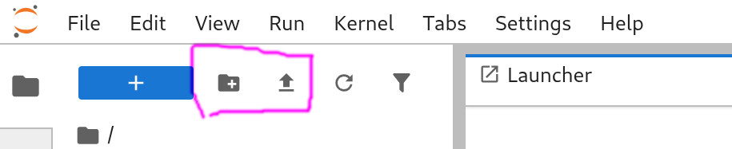
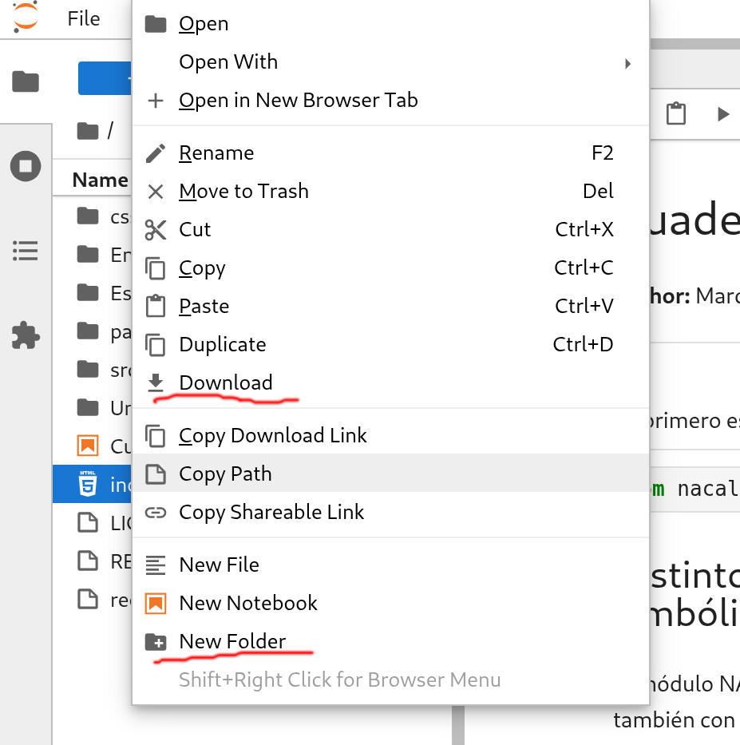

#+title: Cuaderno electrónico para pasar notas de Moodle a las actas de GEA
#+author: Marcos Bujosa
#+LANGUAGE: es

#+OPTIONS: toc:nil

#+PROPERTY: header-args :eval never-export

* Primer paso

La función =de_Moodle_a_actas= requiere el uso del módulo =pandas=. 
También debemos cargar el script de Python =de_moodle_a_actas.py=.
Para cargar tanto el módulo como el script, *ejecuta la siguiente celda de código*.

#+BEGIN_SRC jupyter-python :results no
import pandas as pd
%run de_moodle_a_actas.py
#+END_SRC

#+RESULTS:

* Ejemplo para que lo edites y lo adaptes a tu caso

*Importante*: /Antes de usar el siguiente bloque de código, lee la sección 3 (Cómo usar el programa)./ Luego:
1. Crea la carpeta del grupo (por ejemplo =grupoA=) y sube a dicha carpeta los archivos Excel que has descargado desde Moodle y GEA.
2. Luego edita las cadenas de texto de este bloque de código con los nombres correctos tanto de la carpeta como de los archivos Excel. *Si ejecutas el siguiente bloque de código sin editar correctamente los nombres, obtendrás un error*.

#+BEGIN_SRC jupyter-python :eval no
subdirectorio = 'grupoLetra'                                 # esta carpeta debe estar creada con antelación

ficheroGEA    = 'NombreDelArchivoDescargadoDesdeGEA.xls'     # no te olvides de la extensión del archivo (xls)

ficheroMoodle = 'NombreDelArchivoDescargadoDesdeMoodle.xlsx' # no te olvides de la extensión del archivo (xlsx)
columnaNotas  = 'NombredeLaColumnaConLasNotasParaActas'      # Pasa a actas la columna de calificaciones correcta

actasParaSubirAGEA = 'NombreFicheroASubir.xlsx'              # el fichero con las notas que subirás a GEA 

de_Moodle_a_actas( subdirectorio + '/' + ficheroMoodle,
                   subdirectorio + '/' + ficheroGEA,
                   columnaNotas).to_excel(subdirectorio + '/' + actasParaSubirAGEA,
                                          index=False) 

#+END_SRC

/Nota/: Desde Moodle se descargan archivos con extensión =xlsx=, pero desde GEA puede que la extensión sea =xls=.

** Ejemplo de actas de un grupo ficticio "Alpha". 

Dado que en la carpeta =GrupoAlpha= de este repositorio hay dos archivos Excel similares a los que se obtienen en Moodle y GEA, si ejecutas este bloque se generará un nuevo fichero =acta-grupo-alpha.xls= creado a partir de los dos archivos Excel de la carpeta =GrupoAlpha= donde las notas están cumplimentadas y listas para ser subidas a GEA (si dicho grupo y alumnos fueran reales).

#+BEGIN_SRC jupyter-python :results no :eval no
subdirectorio = 'GrupoAlpha'

ficheroGEA    = 'CalificacionExcel.xls'

ficheroMoodle = '00-123456-Calificaciones.xlsx'
columnaNotas  = 'Total ConvocatoriaOrdinaria (Real)'

actasParaSubirAGEA = 'acta-grupo-alpha.xlsx'

# DataFrame con las actas cumplimentadas
df_Actas = de_Moodle_a_actas( subdirectorio + '/' + ficheroMoodle,
                       subdirectorio + '/' + ficheroGEA,
                       columnaNotas)

# Creación del fichero Excel
df_Actas.to_excel(actasParaSubirAGEA,
                  index=False)

# Visualización del DataFrame
print(df_Actas)
#+END_SRC

# Es probable que obtengas un mensaje de advertencia, porque el método para crear ficheros con la antigua extensión =xls= que utiliza =de_moodle_a_actas.py= está obsoleto. No obstante, en el momento de creación de este cuaderno electrónico, dicho método aún funcionaba (a pesar del mensaje de advertencia).

# (/Esto quiere decir que si GEA continúa funcionando solo con la obsoleta extensión =xls=, este programa dejará de funcionar en algún momento/).

* Cómo usar el programa

** Paso previo

1. *Obtener los archivos Excel del grupo*
   - Accede a [[https://geaportal.ucm.es/index.html]] (si estás fuera de la UCM, deberás activar la VPN).
   - Ve a /Calificación de actas/.
   - Descarga el archivo Excel con las actas vacías del grupo a calificar (=CalificacionExcel.xls=).
   - Descarga las calificaciones de tu grupo desde Moodle en un archivo Excel (por ejemplo, =aa-abcdef-Calificaciones.xlsx=).

   Si necesitas cumplimentar las actas de varios grupos, es recomendable guardar los dos archivos Excel correspondientes a cada grupo en un subdirectorio distinto para cada grupo (véase el siguiente punto).

2. *Crear un directorio para los archivos del grupo*

   Para crear un nuevo directorio, haz clic en el ícono de carpeta que tiene el signo más (+) y que está ubicado en la parte superior de la columna izquierda. Si no ves la columna, puedes mostrarla haciendo clic en el ícono de la carpeta que está a la derecha.

   #+ATTR_ORG: :width 350
   #+ATTR_HTML: :width 350px
   

   - Alternativamente, puedes crear un directorio utilizando el menú emergente que aparece al hacer clic con el botón derecho en la columna izquierda.

3. *Subir los archivos de Excel obtenidos desde Moodle y GEA*

   Para subir tus archivos de Excel a la carpeta recién creada, haz clic en la flecha hacia arriba que se encuentra a la derecha del ícono de carpeta que tiene el signo más (+). Esto te permitirá cargar los archivos en el directorio adecuado para la calificación de tu grupo.

4. *Ejecutar el código y descargar las actas para poder subirlas a GEA*
   
   Ejecuta el código que aparece más abajo y después descarga el archivo Excel con las actas que se habrá generado en el repositorio virtual de MyBinder (utiliza el menú emergente que aparece al hacer clic con el botón derecho en la columna izquierda). Una vez descargadas las actas, puedes subirlas a GEA.

   #+ATTR_ORG: :width 350
   #+ATTR_HTML: :width 350px
   

** Ejemplo de uso

Supongamos que el archivo descargado desde Moodle es =./GrupoAlpha/00-123456-Calificaciones.xlsx= (donde =./GrupoAlpha/= es la ruta hasta el archivo). Y que las calificaciones finales que se van a incluir en las actas se encuentran en la columna con la cabecera =Total ConvocatoriaOrdinaria (Real)=. 

Además, el archivo con las actas sin cumplirmentar es =./GrupoAlpha/CalificacionExcel.xls=. 
(/La carpeta y los archivos Excel del grupo ficticio Alpha ya están creados en la carpeta =GrupoAlpha= del repositorio para que puedas probar este ejemplo/).

Entonces, basta con ejecutar lo siguiente:
#+BEGIN_SRC jupyter-python :results none :eval no
notasConvocatoriaOrdinariaGrupoAlpha = de_Moodle_a_actas('./GrupoAlpha/00-123456-Calificaciones.xlsx',
                                                     './GrupoAlpha/CalificacionExcel.xls',
                                                     'Total ConvocatoriaOrdinaria (Real)')
#+END_SRC
donde =notasConvocatoriaOrdinariaGrupoAlpha= es el nombre del DataFrame con la estructura de las actas, que estará cumplimentado con las notas de Moodle. Para ver el resultado:

#+BEGIN_SRC jupyter-python :eval no
print(notasConvocatoriaOrdinariaGrupoAlpha)
#+END_SRC

Para guardar el DataFrame en un archivo Excel, se recomienda usar un nombre claro (así no habrá confusiones al subirlo a [[https://geaportal.ucm.es]]).
#+BEGIN_SRC jupyter-python :eval no
nombreFichero = 'actaOrdinariaGrupoAlpha'
notasConvocatoriaOrdinariaGrupoAlpha.to_excel(nombreFichero + '.xlsx', index=False)  # Guarda el DataFrame en un archivo Excel
print(f"El archivo Excel {nombreFichero}.xlsx se ha guardado correctamente.")
#+END_SRC

El archivo Excel que hemos creado se puede cargar en la página donde se rellenan las actas del grupo y asignatura correspondiente (haciendo clic en el enlace _"Cargar/descargar fichero Excel"_).

*Ahora vuelve a la sección 2 y prueba con los archivos Excel de tus grupos*.

* COMMENT Exportando este cuaderno electrónico a ipynb             :noexport:

#+BEGIN_SRC emacs-lisp :results silent
(require 'ox-ipynb)
(setq  org-export-with-broken-links t)
(ox-ipynb-export-to-ipynb-file)
;(ox-ipynb-export-to-ipynb-file-and-open)
; (ox-ipynb-export-org-file-to-ipynb-file "DeMoodelaActas.org")
#+END_SRC

# #+ox-ipynb-language: jupyter-python
# #+BEGIN_SRC emacs-lisp :exports none :results silent
# (require 'ox-ipynb)
# (setq  org-export-with-broken-links t)
# (ox-ipynb-export-to-ipynb-file-and-open)
# #+END_SRC

#+BEGIN_SRC jupyter-python :results no :eval no
subdirectorio = 'GrupoAlpha'

ficheroGEA    = 'CalificacionExcel.xls'

ficheroMoodle = '00-123456-Calificaciones.xlsx'
columnaNotas  = 'Total ConvocatoriaOrdinaria (Real)'

actasParaSubirAGEA = 'acta-asignatura-grupo-letra.xlsx'

de_Moodle_a_actas( subdirectorio + '/' + ficheroMoodle,
                   subdirectorio + '/' + ficheroGEA,
                   columnaNotas).to_excel(actasParaSubirAGEA,
                                          index=False) 
#+END_SRC

